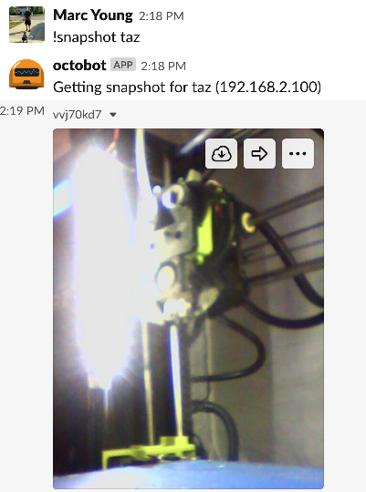
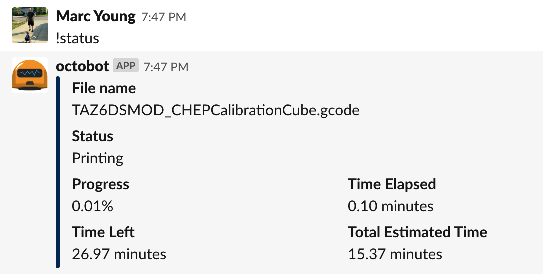
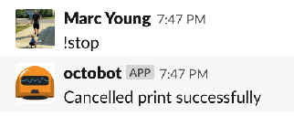

OctoBot
=======

[](https://hub.docker.com/r/myoung34/docker-octobot)

A hubot Slack bot designed to work with [octoprint](http://octoprint.org)


 



## Commands

`!help` - list commands
`!list` - list printers as links
`!stop {printer}` - stop a print
`!cancel {printer}` - stop a print
`!snapshot {printer}` - take a picture from the webcam and send it back as a slack attachment
`!status {printer}` - get status of a printer

## Configuration

Almost everything is configured with environment variables:

`HUBOT_SLACK_TOKEN` - The slack token to use. Generate one [here](https://slack.dev/hubot-slack/)
`HUBOT_SLACK_CHANNEL` - The slack channel to use.
`HUBOT_NAME` - The bot name to assign in slack
`CONFIG` - The JSON configuration. See below

The configuration is a JSON object that represents one or more printers:

```json
{
  "taz": {
    "OCTOPRINT_URL": "192.168.2.100",
    "OCTOPRINT_PROTOCOL": "http://",
    "OCTOPRINT_PORT": "80",
    "MJPG_PORT": "8080",
    "ROTATE": "0",
    "OCTOPRINT_API_TOKEN": "1111111111111111"
  },
  "prusa": {
    "OCTOPRINT_URL": "192.168.2.110",
    "OCTOPRINT_PROTOCOL": "http://",
    "OCTOPRINT_PORT": "80",
    "MJPG_PORT": "8080",
    "ROTATE": "90",
    "OCTOPRINT_API_TOKEN": "2222222222222222"
  }
}
```

## Example

```bash
cat <<EOF >.env
HUBOT_SLACK_TOKEN=xoxb-...
CONFIG={"taz": {"OCTOPRINT_URL": "192.168.2.100", "OCTOPRINT_PROTOCOL": "http://", "OCTOPRINT_PORT": "80", "MJPG_PORT": "8080", "OCTOPRINT_API_TOKEN": "SOMETOKENVALUE"}}
EOF

make run
```
